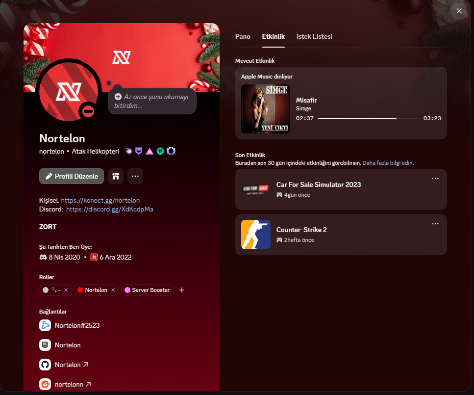

<div align="center">

# 🎵 Apple Music Discord Rich Presence

**Show what you're listening to on Apple Music — directly on your Discord profile.**
Works just like Spotify's Discord integration, but for Apple Music on Windows.



[](https://python.org)
[](https://www.microsoft.com/windows)
[](LICENSE)
[](https://github.com/Nortelon/Apple-Music-for-Discord-RPC)
[](https://discord.com/developers/docs/rich-presence/overview)

</div>

---

## ✨ Features

- 🎵 **Real-time now-playing** — song title & artist update as you skip tracks
- 🖼️ **Album artwork** — fetched automatically from iTunes, no setup required
- ⏱️ **Progress bar** — shows elapsed / total time just like Spotify
- 🌍 **Auto storefront** — detects your system language and uses the right Apple Music region (🇹🇷 `tr`, 🇺🇸 `us`, 🇩🇪 `de` …)
- 🔇 **Background service** — no console window, starts automatically with Windows
- ⚡ **~1 second latency** — PowerShell watcher runs persistently, no cold-start delay

---

## 📋 Requirements

- Windows 10 / 11
- [Apple Music for Windows](https://apps.microsoft.com/detail/9PFHDD62MXS1) (Microsoft Store) or iTunes
- [Python 3.9+](https://www.python.org/downloads/)
- [Discord](https://discord.com) desktop app

---

## 🚀 Setup

### 1 — Create a Discord Application

1. Go to [discord.com/developers/applications](https://discord.com/developers/applications)
2. Click **New Application** → name it **Apple Music**
3. Go to **Rich Presence → Art Assets**
4. Upload your Apple Music logo as **`apple_music_logo`** (PNG, any size)
5. Go to **General Information** → copy your **Application ID**

### 2 — Install dependencies

```bash
pip install pypresence
```

### 3 — Configure

```bash
cp config.example.json config.json
```

Open `config.json` and paste your Application ID:

```json
{
  "discord_client_id": "YOUR_APPLICATION_ID_HERE",
  "poll_interval": 1,
  "fallback_image": "apple_music_logo",
  "apple_music_icon": "apple_music_logo"
}
```

### 4 — Install as background service

```bash
python install.py
```

That's it. ✅ The app starts immediately in the background and will auto-launch every time you log into Windows.

---

## 🛑 Uninstall

```bash
python uninstall.py
```

Stops the running process and removes it from Windows startup.

---

## 🗂️ Project Structure

```
├── main.py          # Discord RPC loop
├── media.py         # Reads now-playing via Windows SMTC (PowerShell watcher)
├── artwork.py       # Fetches album art + Apple Music URL via iTunes Search API
├── config.py        # Loads config.json
├── install.py       # Registers background service + Windows startup
├── uninstall.py     # Stops service + removes from startup
└── rpc.log          # Runtime log (created automatically)
```

---

## 🔧 How It Works

```
Apple Music (SMTC)
      │
      │  PowerShell watcher (persistent, writes every ~1s)
      ▼
 %TEMP%\apple_music_smtc.json
      │
      │  Python reads file (instant, no process spawn)
      ▼
 iTunes Search API ──► album art + track URL
      │
      ▼
 Discord Rich Presence (LISTENING type)
```

Windows exposes playback info through **System Media Transport Controls (SMTC)** — the same API used by the volume overlay when you press media keys. A persistent PowerShell process polls it every second and writes a JSON file. Python reads that file, keeping Discord updated with ~1 second latency.

---

## 🙋 FAQ

**Does it work with iTunes?**
Yes. Both Apple Music (Microsoft Store) and iTunes are detected.

**Why do I need to create a Discord application?**
Discord requires each Rich Presence integration to have its own Application ID. The process takes about 2 minutes.

**Will it affect performance?**
The PowerShell watcher is minimal — it sleeps 1 second between polls. CPU and memory usage is negligible.

**How do I check if it's running?**
Look for `pythonw.exe` in Task Manager, or check `rpc.log` in the project folder.

---

## 📄 License

MIT — free to use, modify, and distribute.
